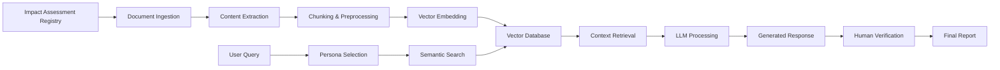

# IAAC AI Document Analysis Tool - Architecture Documentation

## System Overview

The AI-Driven Document Analysis Tool for the Impact Assessment Agency of Canada (IAAC) is designed to process massive multi-format project documents and provide topic-based insights through advanced AI analysis.

## Core Architecture Components

### 1. Frontend Layer (Government Standards Compliant)
- **Framework**: React + TypeScript + Tailwind CSS
- **Design Systems**: 
  - Web Experience Toolkit (WET) for federal accessibility (WCAG 2.1)
  - GC Design System components
  - Alberta Design System integration
- **Key Features**:
  - Responsive dashboard for stakeholder review
  - Document upload interface (supports up to 500MB)
  - Semantic search interface
  - Persona-based query system
  - Real-time analysis results display

### 2. Backend Services (Supabase)
- **Database**: PostgreSQL with pgvector for vector similarity search
- **Storage**: Large document storage (PDFs, HTML, DOC files)
- **Authentication**: RBAC (Role-Based Access Control)
- **Edge Functions**: LLM integration and processing workflows

### 3. Document Processing Pipeline
```
Registry Documents → Ingestion → Chunking → Embedding → Vector Storage → Search
```

### 4. AI/ML Components
- **LLM Integration**: GPT-4o, Gemini, or Grok via API
- **Vector Embeddings**: Document semantic representation
- **RAG (Retrieval-Augmented Generation)**: Context-aware responses
- **Multimodal Support**: Text, tables, maps, and image analysis

### 5. Persona System
Specialized AI personas for different analytical perspectives:
- Fish Habitat Specialist 🐟
- Water Quality Expert 💧
- Caribou Biologist 🦌
- Indigenous Knowledge Keeper 🪶
- Environmental Geologist 🗻

## Data Flow Architecture



## Security & Compliance

### Data Residency
- All data processing within Canadian jurisdiction
- Supabase hosted in Canadian data centers
- Compliance with Privacy Act and PIPEDA

### Security Measures
- End-to-end encryption for document transmission
- RBAC for user access control
- Audit logging for all operations
- Secure API key management via Supabase secrets

### Accessibility
- WCAG 2.1 AA compliance
- Screen reader compatibility
- Keyboard navigation support
- High contrast mode support

## Integration Points

### Current Integrations
- Impact Assessment Registry (public API)
- Supabase (database, storage, auth)
- LLM APIs (OpenAI, Google, xAI)

### Planned Integrations
- GCdocs document management system
- Registry APIs for automated document updates
- Government SSO (MyGCID)
- GCMS (Government of Canada Metadata Schema)

## Scalability Considerations

### Performance Optimization
- Chunked document processing for large files
- Async processing queues for document ingestion
- Cached vector embeddings
- CDN for document delivery

### Storage Strategy
- Hot storage: Recent and frequently accessed documents
- Warm storage: Historical documents (1-3 years)
- Cold storage: Archive documents (3+ years)

## Development Phases

### Phase 1: MVP (Current)
- ✅ Frontend dashboard with GC design standards
- ⏳ Supabase integration setup
- ⏳ Basic document upload and storage
- ⏳ Simple semantic search

### Phase 2: Core AI Features
- Vector embedding pipeline
- LLM integration for analysis
- Persona-based querying
- Basic RAG implementation

### Phase 3: Advanced Features
- Multimodal document analysis
- Source citation and traceability
- Human-in-the-loop verification
- Advanced reporting and visualization

### Phase 4: Production Ready
- Full compliance and security audit
- Performance optimization
- Integration with government systems
- User training and documentation

## Technology Stack

### Frontend
- React 18 with TypeScript
- Tailwind CSS with GC Design System
- Radix UI components for accessibility
- React Query for state management

### Backend
- Supabase (PostgreSQL + pgvector)
- Edge Functions (Deno runtime)
- OpenAI/Google/xAI APIs
- File storage with metadata indexing

### Infrastructure
- Hosted on Lovable platform
- Supabase cloud (Canadian region)
- CDN for asset delivery
- Automated backup and disaster recovery

## Quality Assurance

### Testing Strategy
- Unit tests for core components
- Integration tests for API endpoints
- Accessibility testing (automated + manual)
- Security penetration testing
- Load testing for document processing

### Monitoring & Observability
- Application performance monitoring
- Error tracking and alerting
- Usage analytics and insights
- Security event monitoring